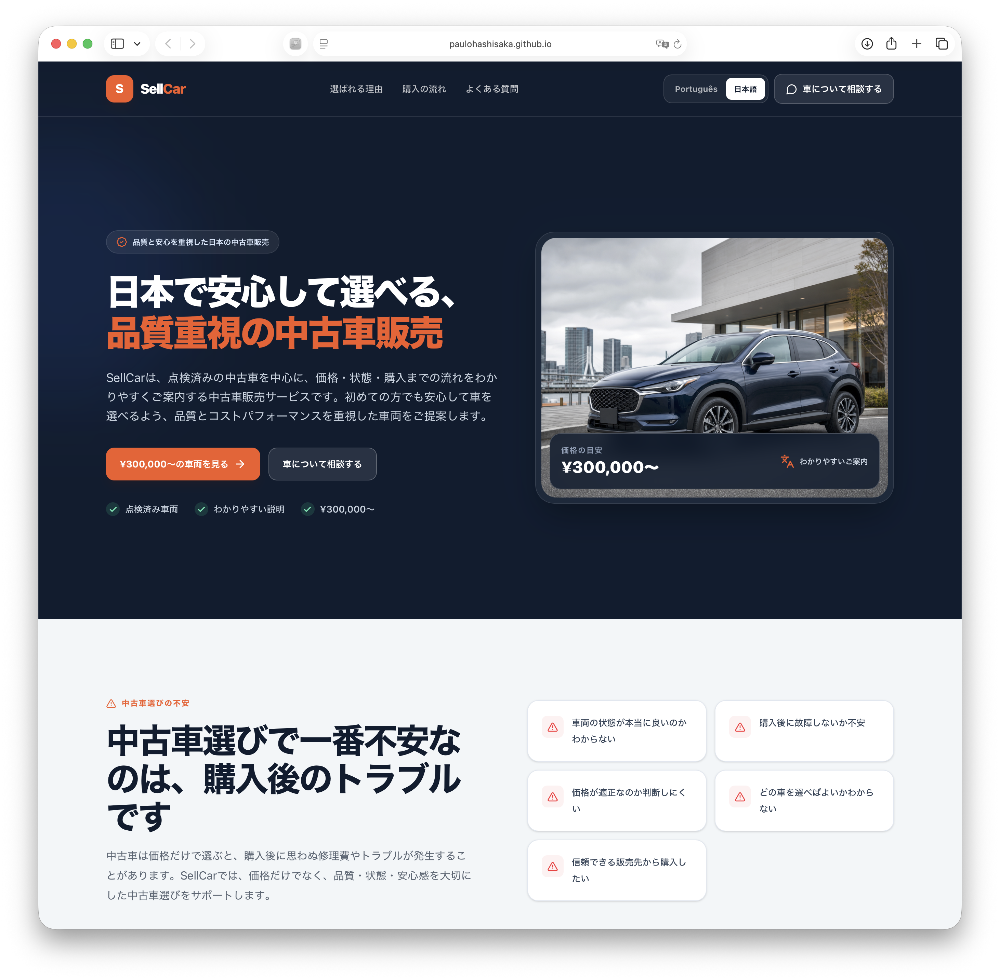

<h1 align="center">SellCar</h1>

<p align="center">
  A responsive bilingual (Portuguese / Japanese) landing page developed during my front-end studies with <strong>DevClub</strong>.
</p>

<p align="center">
  
  
  
  
  
</p>

---

## 📌 About the project

**SellCar** is a responsive landing page created to practice front-end development skills using **React**, **Vite**, and **Tailwind CSS**.

This project was developed as part of my studies with **DevClub**, with a focus on improving my understanding of:

- component-based structure with React
- state management with hooks (`useState`, `useEffect`)
- multi-language content (Portuguese / Japanese) with the choice persisted in the browser
- Tailwind CSS styling and utility-first workflows
- responsive design
- file and project organization with Vite

It represents another important step in my learning journey as I continue building a solid foundation in web development.

---

## 🖼️ Preview

<p align="center">
  
</p>

---

## 🚀 Technologies used

- **React**
- **Vite**
- **Tailwind CSS**
- **ESLint**

---

## ✨ Features

- Responsive layout
- Portuguese / Japanese language toggle, with the selection saved in `localStorage`
- Component-based structure (Hero, FAQ, Footer, Content Sections, etc.)
- Clean visual design
- Desktop and mobile adaptation
- Organized project file structure

---

## 📚 What I learned

Through this project, I practiced and improved skills such as:

- building a responsive layout with React and Tailwind CSS
- managing UI state and side effects with React hooks
- implementing multi-language content and persisting user preferences
- structuring components and content in a Vite project
- preparing a React project for publication on GitHub

---

## 🌐 Live Demo

[Click here to view the project](https://paulohashisaka.github.io/sellcar-landing-page/)

---

## 📁 Project structure

```bash
sellcar-landing-page/
├── public/
│   └── images/
├── src/
│   ├── components/
│   ├── content/
│   ├── App.jsx
│   ├── index.css
│   └── main.jsx
├── index.html
├── package.json
└── README.md
```

---

## 🛠️ Requirements

- Node.js 20.19+ or 22.12+
- npm

## 📦 Installation

```bash
npm install
```

## 💻 Development

```bash
npm run dev
```

Open the address shown by Vite in the terminal.

## 🏗️ Production build

```bash
npm run build
npm run preview
```

## 🎨 Customization

- Replace the demo e-mail in `src/components/ContentSections.jsx`.
- Edit texts and testimonials in `src/content/translations.js`.
- Update prices and conditions according to SellCar's official data.

---

## Acknowledgements

This project was developed as part of my studies with **DevClub**.

Special thanks to [@rodolfomori](https://github.com/rodolfomori) for the guidance, support, and valuable lessons that helped me build this project and continue growing as a developer.
